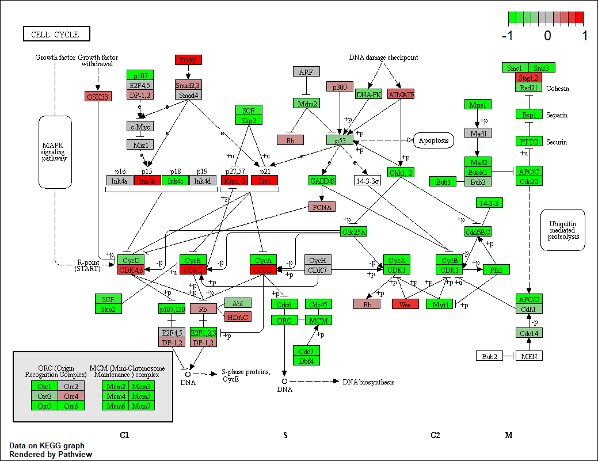

```{r setup, include=FALSE}
knitr::opts_chunk$set(echo = TRUE)
```

## SECTION 1. DIFFERENTIAL EXPRESSION ANALYSIS

```{r}
library(dplyr)
library(DESeq2)
```

```{r}
# load our data files
metaFile <- "data/GSE37704_metadata.csv"
countFile <- "data/GSE37704_featurecounts.csv"

# import metadata
colData <-read.csv(metaFile, row.names = 1)
head(colData)

# import countdata
countData <- read.csv(countFile, row.names = 1)
head(countData)
```

```{r}
# remove odd first column in column in countData
countData <- as.matrix(countData[,-1])
head(countData)
```

```{r}
# filter countData where you have 0 read count across all samples
countData <- countData[rowSums(countData) > 1,]
head(countData)
```

```{r}
# setup DESeqDataSet object required for the DESeq() function and then running DESeq pipeline
dds <- DESeqDataSetFromMatrix(countData = countData, colData = colData, design = ~condition)
dds <- DESeq(dds)
dds

# count rows
dim(countData)
```

```{r}
# get results for the HoxA1 knockdown versus control siRNA (remember we labeled these as “hoxa1_kd” and “control_sirna” in our original colData metaFile input to DESeq, you can check this above and by running resultsNames(dds) command)
res <- results(dds, contrast = c("condition", "hoxa1_kd", "control_sirna"))

# reorder these results by p-value and call summary() on the results object to get a sense of how many genes are up or down-regulated at the default FDR of 0.1
res <- res[order(res$pvalue),]
summary(res)

# Since we mapped and counted against the Ensembl annotation, our results only have information about Ensembl gene IDs. However, our pathway analysis downstream will use KEGG pathways, and genes in KEGG pathways are annotated with Entrez gene IDs. So lets add them as we did the last day.
library("AnnotationDbi")
library("org.Hs.eg.db")

columns(org.Hs.eg.db)

res$symbol = mapIds(org.Hs.eg.db,
                    keys=row.names(res), 
                    column="SYMBOL",
                    keytype="ENSEMBL",
                    multiVals="first")

res$entrez = mapIds(org.Hs.eg.db,
                    keys=row.names(res), 
                    column="ENTREZID",
                    keytype="ENSEMBL",
                    multiVals="first")

res$name =   mapIds(org.Hs.eg.db,
                    keys=row.names(res), 
                    column="GENENAME",
                    keytype="ENSEMBL",
                    multiVals="first")

head(res, 10)
```

## SECTION 2. PATHWAY ANALYSIS

```{r}
## KEGG pathways
# installing
# source("http://bioconductor.org/biocLite.R")
# biocLite(nc("pathview", "gage", "gageData"))

# loading packages and setup the KEGG data-sets
library(pathview)
library(gage)
library(gageData)

data("kegg.sets.hs")
data("sigmet.idx.hs")

kegg.sets.hs <- kegg.sets.hs[sigmet.idx.hs]
head(kegg.sets.hs, 3)
```

```{r}
# The main gage() function requires a named vector of fold changes, where the names of the values are the Entrez gene IDs.
foldchanges <- res$log2FoldChange
names(foldchanges) <- res$entrez
head(foldchanges)
```

```{r}
## running pathway analysis
# get the results
keggres <- gage(foldchanges, gsets = kegg.sets.hs, same.dir = TRUE)

# looking at the result object
attributes(keggres)

head(keggres$greater)
head(keggres$less)

lapply(keggres, head)
```

```{r}
# process the results to pull out the top 5 upregulated pathways then further process that just to get the IDs. using KEGG pathway IDs downstream for plotting
# Sanity check displaying all pathways data
pathways <- data.frame(id = rownames(keggres$greater), keggres$greater)
head(pathways)
```

# tryout pathview() function from the pathview package to make a pathway plot with our results shown in color
```{r}
# manually supply a pathway.id (namely the first part of the "hsa04110 Cell cycle") that we could see from the print out above
pathview(gene.data = foldchanges, pathway.id = "hsa04110")

# A different PDF based output of the same data
pathview(gene.data=foldchanges, pathway.id="hsa04110", kegg.native=FALSE)

# Here is the default low resolution raster PNG output from the first pathview() call above
```


```{r}
## Now, let’s process our results a bit more to automagicaly pull out the top 5 upregulated pathways, then further process that just to get the IDs needed by the pathview() function. We’ll use these KEGG pathway IDs for plotting below.
# Focus on top 5 upregulated pathways here for demo purposes only
keggrespathways <- rownames(keggres$greater)[1:5]

# Extract the IDs part of each string
keggresids = substr(keggrespathways, start=1, stop=8)
keggresids

# Finally, lets pass these IDs in keggresids to the pathview() function to draw plots for all the top 5 pathways.
pathview(gene.data=foldchanges, pathway.id=keggresids, species="hsa")
```

## SECTION 3. GENE ONTOLOGY (GO)
```{r}
# We can also do a similar procedure with gene ontology. Similar to above, go.sets.hs has all GO terms. go.subs.hs is a named list containing indexes for the BP, CC, and MF ontologies. Let’s only do Biological Process.
data(go.sets.hs)
data(go.subs.hs)
gobpsets = go.sets.hs[go.subs.hs$BP]

gobpres = gage(foldchanges, gsets=gobpsets, same.dir=TRUE)

lapply(gobpres, head)
```

## SECTION 4. REACTOME PATHWAY ANALYSIS
```{r}
# First, Using R, output the list of significant genes at the 0.05 level as a plain text file:
sig_genes <- res[res$padj <= 0.05 & !is.na(res$padj), "symbol"]
print(paste("Total number of significant genes:", length(sig_genes)))

write.table(sig_genes, file="significant_genes.txt", row.names=FALSE, col.names=FALSE, quote=FALSE)
```

