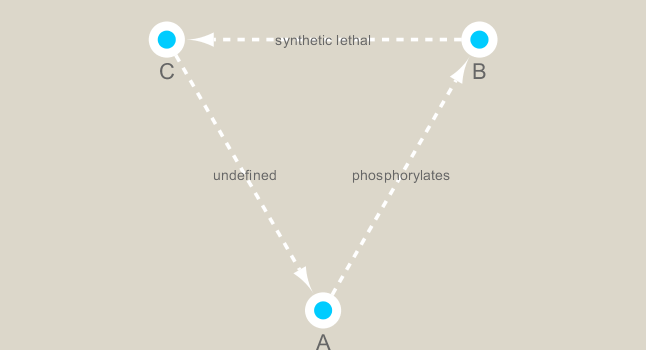

```{r setup, include=FALSE}
knitr::opts_chunk$set(echo = TRUE)
```

```{r}
# CRAN packages
# install.packages(c("igraph", "RColorBrewer"))

# Bioconductor package
# source("https://bioconductor.org/biocLite.R")
# biocLite("RCy3")

library(RCy3)
library(igraph)
library(RColorBrewer)
```

First Contact

```{r}
library(RCy3)
cwd <- demoSimpleGraph()
```

```{r}
layoutNetwork(cwd, 'force-directed')

# choose any of the other possible Layouts e.g.:
possible.layout.names <- getLayoutNames(cwd)
layoutNetwork(cwd, possible.layout.names[1])

# Test the connection to Cytoscape
ping(cwd)
```

Switch Styles

```{r}
setVisualStyle(cwd, "Marquee")

styles <- getVisualStyleNames(cwd)
styles

# trying other styles,e.g.
# setVisualStyle(cwd, styles[13])
# setVisualStyle(cwd, styles[18])
```

```{r}
# saving image
saveImage(cwd, file.name = "demo", image.type = "png", h = 350)

library(knitr)

```


Section 2. Read our metagenomics data

```{r}
# scripts for processing Located in "inst/data-raw/"
prok_vir_cor <- read.delim("./data/virus_prok_cor_abundant.tsv", stringsAsFactors = FALSE)

# peak at the first 6 rows
head(prok_vir_cor)
```

# Using Igraph package

```{r}
g <- graph.data.frame(prok_vir_cor, directed = FALSE)
class(g)
g

# common igraph functions for creating network graphs include: graph_from_data_frame(), graph_from_edgelist(), and graph_from_adjacency_matrix()

plot(g)
plot(g, vertex.size = 3, vertex.label = NA)

V(g)
E(g)

# there are also the functions vertex.attributes() and edge.attributes() that query all vertex and edge attributes of a igraph object
```

Section 3. Read in taxonomic classification

```{r}
phage_id_affiliation <- read.delim("./data/phage_ids_with_affiliation.tsv")
head(phage_id_affiliation)
```

```{r}
bac_id_affi <- read.delim("./data/prok_tax_from_silva.tsv")
head(bac_id_affi)
```

Section 4. Add the taxonomic classifications to the network and then send network to Cytoscape

```{r}
## Create our gene network 'genenet' for cytoscape
genenet.nodes <- as.data.frame(vertex.attributes(g))

## not all have classification, so create empty columns
genenet.nodes$phage_aff <- rep("not_class", nrow(genenet.nodes))
genenet.nodes$Tax_order <- rep("not_class", nrow(genenet.nodes))
genenet.nodes$Tax_subfamily <- rep("not_class", nrow(genenet.nodes))

for (row in seq_along(1:nrow(genenet.nodes))){
  if (genenet.nodes$name[row] %in% phage_id_affiliation$first_sheet.Phage_id_network){
    id_name <- as.character(genenet.nodes$name[row])
    aff_to_add <- unique(subset(phage_id_affiliation,
                                first_sheet.Phage_id_network == id_name,
                                select = c(phage_affiliation,
                                           Tax_order,
                                           Tax_subfamily)))
    genenet.nodes$phage_aff[row] <- as.character(aff_to_add$phage_affiliation)
    genenet.nodes$Tax_order[row] <- as.character(aff_to_add$Tax_order)
    genenet.nodes$Tax_subfamily[row] <- as.character(aff_to_add$Tax_subfamily)
  }
}
```

```{r}
## do the same for proks
genenet.nodes$prok_king <- rep("not_class", nrow(genenet.nodes))
genenet.nodes$prok_tax_phylum <- rep("not_class", nrow(genenet.nodes))
genenet.nodes$prok_tax_class <- rep("not_class", nrow(genenet.nodes))

for (row in seq_along(1:nrow(genenet.nodes))){
  if (genenet.nodes$name[row] %in% bac_id_affi$Accession_ID){
    aff_to_add <- unique(subset(bac_id_affi,
                                Accession_ID == as.character(genenet.nodes$name[row]),
                                select = c(Kingdom,
                                           Phylum,
                                           Class)))
    
    genenet.nodes$prok_king[row] <- as.character(aff_to_add$Kingdom)
    genenet.nodes$prok_tax_phylum[row] <- as.character(aff_to_add$Phylum)
    genenet.nodes$prok_tax_class[row] <- as.character(aff_to_add$Class)
  }
}
```

# Add to the network the data related to the connections between the organisms, the edge data, and then prepare to send the nodes and edges to Cytoscape using the function cyPlot().
```{r}
genenet.edges <- data.frame(igraph::as_edgelist(g))
names(genenet.edges) <- c("name.1", "name.2")

genenet.edges$Weight <- igraph::edge_attr(g)[[1]]

genenet.edges$name.1 <- as.character(genenet.edges$name.1)
genenet.edges$name.2 <- as.character(genenet.edges$name.2)
genenet.nodes$name <- as.character(genenet.nodes$name)

ug <- cyPlot(genenet.nodes,genenet.edges)
```

# Send network to Cytoscape using RCy3

```{r}
cy <- CytoscapeConnection()
deleteAllWindows(cy)

cw <- CytoscapeWindow("Tara oceans", graph = ug, overwriteWindow = TRUE)

displayGraph(cw)
layoutNetwork(cw)
fitContent(cw)
```

Section 5. Color network by prokaryotic phylum

```{r}
families_to_colour <- unique(genenet.nodes$prok_tax_phylum)
families_to_colour <- families_to_colour[!families_to_colour %in% "not_class"]
node.colour <- RColorBrewer::brewer.pal(length(families_to_colour), "Set3")
```

```{r}
# Use the colors from Rcolorbrewer to color the nodes in Cytoscape.
setNodeColorRule(cw,
                 "prok_tax_phylum",
                 families_to_colour,
                 node.colour,
                 "lookup",
                 default.color = "#ffffff")

displayGraph(cw)
layoutNetwork(cw)
fitContent(cw)
```

# Set node shape to reflect virus or prokaryote
```{r}
shapes_for_nodes <- c("DIAMOND")

phage_names <- grep("ph_",
                    genenet.nodes$name,
                    value = TRUE)
setNodeShapeRule(cw,
                 "label",
                 phage_names,
                 shapes_for_nodes)

displayGraph(cw)
fitContent(cw)
```

# Color edges of phage nodes

```{r}
# The classification of the viral data was done in a very conservative manner so not many of the viral nodes were identified. However, if we do want to add some of this information to our visualization we can color the edges of the viral nodes by family. The main families that were identified in this dataset are the Podoviridae, the Siphoviridae and the Myoviridae (for more info see NCBI Podoviridae, NCBI Myoviridae, and NCBI Siphoviridae)

setDefaultNodeBorderWidth(cw, 5)
families_to_colour <- c(" Podoviridae",
                        " Siphoviridae",
                        " Myoviridae")
node.colour <- RColorBrewer::brewer.pal(length(families_to_colour),
                          "Dark2")
setNodeBorderColorRule(cw,
                       "Tax_subfamily",
                       families_to_colour,
                       node.colour,
                       "lookup", 
                       default.color = "#000000")

displayGraph(cw)
fitContent(cw)
```

Section 6. Setup a layout to minimize overlap of nodes

```{r}
# When using RCy3 to drive Cytoscape, if we are not sure what the current values are for a layout or we are not sure what kinds of values are accepted for the different parameters of our layout, we can investigate using the RCy3 functions getLayoutPropertyNames() and then getLayoutPropertyValue().

getLayoutNames(cw)
```

```{r}
getLayoutPropertyNames(cw, layout.name = "force-directed")
```

```{r}
getLayoutPropertyValue(cw, "force-directed", "defaultSpringLength")
```

```{r}
getLayoutPropertyValue(cw, "force-directed", "numIterations")
```

```{r}
setLayoutProperties(cw, layout.name = "force-directed", list(defaultSpringLength = 20, "numIterations" = 200))
layoutNetwork(cw, layout.name = "force-directed")
fitContent(cw)
```

Section 7. Examine network properties

# One thing that might be interesting to visualize is nodes that are connected to many different nodes and nodes that are connected to few other nodes. The number of other nodes to which one node is connected is called degree. We can use a gradient of size to quickly visualize nodes that have high degree.

```{r}
## initiate a new node attribute
ug2 <- initNodeAttribute(graph = ug,
                          "degree",
                          "numeric",
                          0.0) 

## degree from graph package for undirected graphs not working well,
## so instead using igraph to calculate this from the original graph
nodeData(ug2, nodes(ug2), "degree") <- igraph::degree(g)

cw2 <- CytoscapeWindow("Tara oceans with degree",
                      graph = ug2,
                      overwriteWindow = TRUE)

displayGraph(cw2)
layoutNetwork(cw2)
```

# size by degree
```{r}
degree_control_points <- c(min(igraph::degree(g)),
                           mean(igraph::degree(g)),
                           max(igraph::degree(g)))
node_sizes <- c(20,
                20,
                80,
                100,
                110) # number of control points in interpolation mode,
                     # the first and the last are for sizes "below" and "above" the attribute seen.

setNodeSizeRule(cw2,
                "degree",
                degree_control_points,
                node_sizes,
                mode = "interpolate")

layoutNetwork(cw2,
              "force-directed")
```

Section 8. Select an interesting node and make a subnetwork from it

```{r}
# Selects the node named "GQ377772"
selectNodes(cw2, "GQ377772") 
getSelectedNodes(cw2)
```

```{r}
selectFirstNeighborsOfSelectedNodes(cw2)
getSelectedNodes(cw2)
```

```{r}
# Now select the neighbors of node "GQ377772"
selectFirstNeighborsOfSelectedNodes(cw2)
getSelectedNodes(cw2)
```

```{r}
# Create sub-network from these nodes and their edges.
newnet <- createWindowFromSelection(cw2,
                                    "subnet",
                                    "TRUE")

layoutNetwork(newnet, "force-directed")
```

