K means example-----------


Generate some example data for clustering

```r
tmp <- c(rnorm(30,-3), rnorm(30,3))
x <- cbind(x=tmp, y=rev(tmp))
plot(x)
```

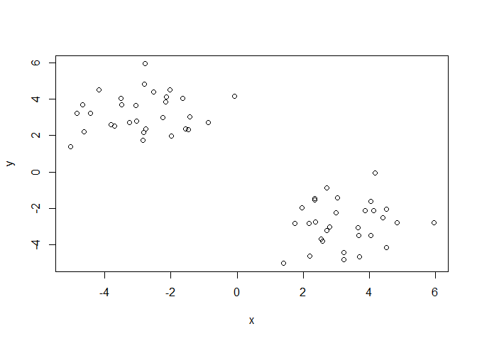<!-- -->


use the kmeans() functions setting K to 2 and nstart=20


```r
km <- kmeans(x, centers = 2, nstart=20 )
```

inspect/print the results

```r
km
```

```
## K-means clustering with 2 clusters of sizes 30, 30
## 
## Cluster means:
##           x         y
## 1  3.267733 -2.860357
## 2 -2.860357  3.267733
## 
## Clustering vector:
##  [1] 2 2 2 2 2 2 2 2 2 2 2 2 2 2 2 2 2 2 2 2 2 2 2 2 2 2 2 2 2 2 1 1 1 1 1
## [36] 1 1 1 1 1 1 1 1 1 1 1 1 1 1 1 1 1 1 1 1 1 1 1 1 1
## 
## Within cluster sum of squares by cluster:
## [1] 75.78262 75.78262
##  (between_SS / total_SS =  88.1 %)
## 
## Available components:
## 
## [1] "cluster"      "centers"      "totss"        "withinss"    
## [5] "tot.withinss" "betweenss"    "size"         "iter"        
## [9] "ifault"
```

Q. How many points are in each cluster?
Q. What 'component' of your result object details: cluster size, assignement/membership, centers


```r
km$cluster
```

```
##  [1] 2 2 2 2 2 2 2 2 2 2 2 2 2 2 2 2 2 2 2 2 2 2 2 2 2 2 2 2 2 2 1 1 1 1 1
## [36] 1 1 1 1 1 1 1 1 1 1 1 1 1 1 1 1 1 1 1 1 1 1 1 1 1
```

```r
km$centers
```

```
##           x         y
## 1  3.267733 -2.860357
## 2 -2.860357  3.267733
```

```r
km$size
```

```
## [1] 30 30
```


plot x colored by the kmeans cluster assignment and add cluster centers as blue points


```r
plot(x, col=km$cluster)
points(km$centers, col = "blue", pch=15)
```

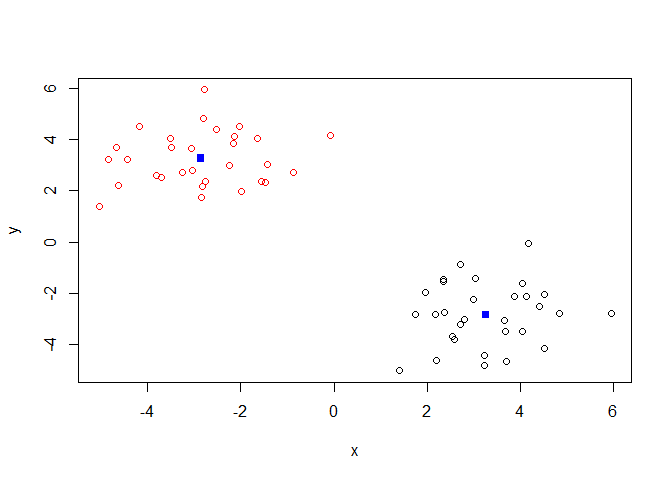<!-- -->


Q. Repeat for k=3, which one has the better total SS?


```r
km3 <- kmeans(x, centers = 3, nstart = 20)
km3
```

```
## K-means clustering with 3 clusters of sizes 30, 16, 14
## 
## Cluster means:
##           x         y
## 1  3.267733 -2.860357
## 2 -3.756239  2.915326
## 3 -1.836493  3.670485
## 
## Clustering vector:
##  [1] 3 2 2 2 2 2 3 2 2 3 3 2 2 2 3 2 3 3 3 3 3 2 2 3 3 2 3 3 2 2 1 1 1 1 1
## [36] 1 1 1 1 1 1 1 1 1 1 1 1 1 1 1 1 1 1 1 1 1 1 1 1 1
## 
## Within cluster sum of squares by cluster:
## [1] 75.78262 20.18130 23.82551
##  (between_SS / total_SS =  90.6 %)
## 
## Available components:
## 
## [1] "cluster"      "centers"      "totss"        "withinss"    
## [5] "tot.withinss" "betweenss"    "size"         "iter"        
## [9] "ifault"
```

```r
km3$withinss
```

```
## [1] 75.78262 20.18130 23.82551
```

########Hierarchial clustering example-----------

First we need to calculate point (dis)similarity

as the Euclidean distance between observations


```r
dist_matrix <- dist(x)
dist_matrix
```

```
##              1           2           3           4           5           6
## 2   1.27563464                                                            
## 3   2.64137580  1.82356721                                                
## 4   3.15035702  1.87978575  2.14640303                                    
## 5   3.47729353  2.25538271  1.55959030  1.04699553                        
## 6   2.05212919  1.32072820  0.58926762  2.14540769  1.84143781            
## 7   0.63256641  0.86690432  2.56507822  2.64833147  3.11919028  1.99931654
## 8   1.36081570  0.20571400  1.97176164  1.79598864  2.26660893  1.49435965
## 9   3.45167185  2.55936207  0.81194980  2.35022139  1.44727583  1.40048409
## 10  1.00324002  0.81053059  1.63838386  2.51731577  2.61384096  1.04912119
## 11  0.71544695  1.91939863  2.95695705  3.79580558  4.01121621  2.38581257
## 12  2.42363598  1.50543484  0.35246339  1.86000387  1.41795969  0.44726722
## 13  3.08643885  1.88720582  1.22417830  1.04930819  0.40809263  1.44596815
## 14  2.23601103  0.96637424  1.50843138  0.97950690  1.32772517  1.29812420
## 15  1.90498077  1.86460751  1.37780512  3.15234682  2.85584270  1.03288102
## 16  3.68236349  2.48324235  3.04698274  0.90229686  1.83761864  3.00916928
## 17  2.31773858  3.23694864  3.44041603  4.96781175  4.86644177  3.02734314
## 18  1.71567730  2.01506428  1.87006225  3.51411310  3.30861164  1.46759003
## 19  2.25170347  2.26613636  1.54849049  3.47632519  3.08886476  1.33162840
## 20  2.31829947  2.05786340  1.06534566  3.06095597  2.61510382  0.92918147
## 21  0.69573940  1.47749119  2.30094815  3.29946860  3.41322167  1.73410690
## 22  3.46025753  2.32450506  1.19852275  1.50264203  0.51124986  1.60828580
## 23  1.63390694  0.52139530  1.31237420  1.69162082  1.84479881  0.85448517
## 24  3.83390822  3.57468609  2.04665723  4.17494164  3.41271461  2.30375205
## 25  2.81939654  2.45494966  1.05641664  3.19227851  2.58661647  1.19243016
## 26  2.34296985  1.07578622  1.48385006  0.90019237  1.21738907  1.31815556
## 27  0.06719711  1.21006822  2.58121115  3.08590339  3.41010746  1.99207997
## 28  1.66359433  1.60890166  1.36790807  2.98230128  2.76628239  0.92490980
## 29  1.80112713  0.59216351  1.35192605  1.47335128  1.68131299  0.97052365
## 30  1.48868038  0.63437959  2.38351888  1.84123128  2.48844708  1.92630767
## 31  6.11348116  6.89736385  8.66180234  8.13672980  8.96651831  8.08917573
## 32  6.98784435  7.84296160  9.57810743  9.14424768  9.95194440  8.99846496
## 33  6.98763258  8.02404556  9.62899964  9.54917279 10.24041950  9.03976115
## 34  5.46869094  6.44849298  8.10189424  7.93395301  8.64526645  7.51427562
## 35  7.37890753  8.17581672  9.93814802  9.39590328 10.23793106  9.36426014
## 36  8.15033290  9.19164756 10.79158486 10.70852842 11.40689231 10.20231754
## 37  9.02936415 10.12142045 11.66205972 11.69758972 12.35719747 11.07405828
## 38  6.89147805  7.77234985  9.49366428  9.10739793  9.89985211  8.91184149
## 39  8.71958087  9.55760579 11.30407802 10.80311300 11.63884220 10.72595266
## 40  5.89307105  6.93740202  8.53444658  8.48936274  9.16114260  7.94519832
## 41  7.64465371  8.68517812 10.28597882 10.20689557 10.90143180  9.69671258
## 42  7.43718176  8.51722071 10.07436505 10.09204144 10.75089041  9.48562247
## 43  6.81909304  7.90563366  9.45551584  9.49576720 10.14287677  8.86687198
## 44  6.15921510  7.35989839  8.72151752  9.10274512  9.61313778  8.14457350
## 45  7.93073590  8.50648643 10.32446807  9.43197506 10.36859957  9.78113253
## 46  7.18326334  8.23633717  9.82414033  9.77977108 10.45957928  9.23489909
## 47  7.26921956  8.06981696  9.83042605  9.29712090 10.13600385  9.25613461
## 48  8.26159614  9.07497350 10.83198485 10.29697776 11.14085079 10.25637603
## 49  7.80164918  8.72050709 10.42057752 10.08519184 10.86632648  9.83581754
## 50  5.28053597  6.35677828  7.92034010  7.95694260  8.59430452  7.33120917
## 51  6.41218086  7.38044003  9.04407862  8.83170599  9.56494120  8.45676497
## 52  8.85083291  9.78103069 11.47478224 11.14446923 11.92847579 10.88915466
## 53  6.34492316  7.18128991  8.92408389  8.47610962  9.28430659  8.34619361
## 54  5.54199142  6.43602123  8.14673096  7.82135637  8.58542887  7.56409849
## 55  7.45759036  8.40905764 10.08642399  9.82064012 10.57761418  9.49975842
## 56  8.59599331  9.38091250 11.15007063 10.55987321 11.42081974 10.57761418
## 57  7.88915147  8.58614172 10.38218254  9.66784565 10.55987321  9.82064012
## 58  8.04540796  8.98940104 10.67276745 10.38218254 11.15007063 10.08642399
## 59  6.39623795  7.25996645  8.98940104  8.58614172  9.38091250  8.40905764
## 60  5.41112915  6.39623795  8.04540796  7.88915147  8.59599331  7.45759036
##              7           8           9          10          11          12
## 2                                                                         
## 3                                                                         
## 4                                                                         
## 5                                                                         
## 6                                                                         
## 7                                                                         
## 8   0.86901887                                                            
## 9   3.34657998  2.68201644                                                
## 10  1.06085087  1.00832308  2.44928152                                    
## 11  1.34641792  2.03523432  3.76103649  1.40398952                        
## 12  2.28499435  1.64176912  1.06221425  1.43414046  2.80859293            
## 13  2.75405093  1.91757422  1.30105358  2.20839336  3.60800084  1.03672946
## 14  1.81058466  0.94578798  2.02170383  1.53848228  2.84708163  1.16158295
## 15  2.16907040  2.07017782  2.06859632  1.13804313  1.90652363  1.43790859
## 16  3.10266288  2.34284952  3.22735084  3.22468307  4.37468627  2.75285654
## 17  2.93049979  3.40886309  4.10984003  2.47031843  1.67459850  3.46502954
## 18  2.11275989  2.21673532  2.57068094  1.21169558  1.54897152  1.89760348
## 19  2.55669247  2.47153789  2.12900983  1.53818516  2.16159984  1.68572113
## 20  2.50545793  2.25720257  1.65639700  1.44525378  2.37459268  1.22963376
## 21  1.20451897  1.63700447  3.10384700  0.80500035  0.65741747  2.16333235
## 22  3.18669576  2.38000169  0.94176404  2.52263368  3.92402894  1.16115271
## 23  1.34948737  0.65954289  2.03799102  0.83043485  2.18368098  0.98634443
## 24  4.05908378  3.76600068  1.99847992  2.99942672  3.76464571  2.37682328
## 25  2.97614665  2.64550605  1.39443353  1.91675885  2.87704511  1.33697806
## 26  1.92212325  1.05757676  1.95884088  1.62602116  2.94815055  1.14344459
## 27  0.59168823  1.29807154  3.39095920  0.94393048  0.76483601  2.36053804
## 28  1.90417748  1.81461245  2.11709911  0.87070638  1.72910289  1.36109564
## 29  1.45679030  0.66836155  2.02268005  1.04544770  2.37819996  1.00654412
## 30  0.88268917  0.43724585  3.06332196  1.39133048  2.20038557  2.04473046
## 31  6.09739737  6.80497236  9.44149998  7.07796311  6.14076474  8.37928945
## 32  7.02258717  7.76147900 10.36841931  7.97111709  6.94773550  9.30744735
## 33  7.16314510  7.98171753 10.43883429  7.99078044  6.78584433  9.39986236
## 34  5.59529352  6.39583840  8.90686577  6.46933346  5.34213429  7.85694393
## 35  7.37434246  8.08309401 10.71920541  8.34925111  7.37969129  9.65699319
## 36  8.33066115  9.14898843 11.60196094  9.15320615  7.93381353 10.56491794
## 37  9.25553701 10.09171294 12.47400849 10.02717537  8.75488129 11.45271042
## 38  6.94446467  7.69596765 10.28762347  7.87972392  6.83156592  9.22795472
## 39  8.74489180  9.47033441 12.09146744  9.70118424  8.67647600 11.02977008
## 40  6.07482263  6.89906162  9.34440189  6.89618767  5.69603568  8.30629357
## 41  7.82407033  8.64294728 11.09620742  8.64762320  7.43281371 10.05864309
## 42  7.65186542  8.48580993 10.88608792  8.43737013  7.18609133  9.85904805
## 43  7.03968794  7.87691667 10.26730104  7.81881994  6.56637879  9.24147445
## 44  6.50391643  7.37114113  9.52696975  7.12111045  5.76595053  8.55367198
## 45  7.79129173  8.37870515 11.06063332  8.83076644  8.07833528 10.01190302
## 46  7.37345970  8.19799089 10.63489897  8.18579062  6.96268991  9.60006337
## 47  7.26692581  7.97792996 10.61215044  8.24032225  7.26842171  9.54995021
## 48  8.26952135  8.98381329 11.61544283  9.23716539  8.24126158 10.55330844
## 49  7.88374288  8.65023752 11.21955963  8.79698982  7.70040547 10.16270672
## 50  5.49098492  6.32815726  8.73155033  6.28227045  5.05849982  7.70040547
## 51  6.53072106  7.32307287  9.84828127  7.41242201  6.28227045  8.79698982
## 52  8.94240836  9.71178653 12.27529463  9.84828127  8.73155033 11.21955963
## 53  6.36526974  7.09763701  9.71178653  7.32307287  6.32815726  8.65023752
## 54  5.60207081  6.36526974  8.94240836  6.53072106  5.49098492  7.88374288
## 55  7.56409849  8.34619361 10.88915466  8.45676497  7.33120917  9.83581754
## 56  8.58542887  9.28430659 11.92847579  9.56494120  8.59430452 10.86632648
## 57  7.82135637  8.47610962 11.14446923  8.83170599  7.95694260 10.08519184
## 58  8.14673096  8.92408389 11.47478224  9.04407862  7.92034010 10.42057752
## 59  6.43602123  7.18128991  9.78103069  7.38044003  6.35677828  8.72050709
## 60  5.54199142  6.34492316  8.85083291  6.41218086  5.28053597  7.80164918
##             13          14          15          16          17          18
## 2                                                                         
## 3                                                                         
## 4                                                                         
## 5                                                                         
## 6                                                                         
## 7                                                                         
## 8                                                                         
## 9                                                                         
## 10                                                                        
## 11                                                                        
## 12                                                                        
## 13                                                                        
## 14  1.00613929                                                            
## 15  2.46965593  2.23865240                                                
## 16  1.93118802  1.75285922  3.98802780                                    
## 17  4.46558932  3.99045315  2.06347919  5.69476096                        
## 18  2.91323467  2.56238384  0.50217425  4.31221643  1.57277358            
## 19  2.72059384  2.59247624  0.40326504  4.33119063  1.99732236  0.61984307
## 20  2.25575665  2.22509460  0.47554800  3.93462385  2.45427841  0.94941806
## 21  3.00635915  2.32624437  1.29904891  3.95891453  1.78143617  1.03427624
## 22  0.52215840  1.50600829  2.56250348  2.33570923  4.61438457  3.04207388
## 23  1.45258528  0.71234035  1.60966717  2.43878598  3.27883381  1.87980283
## 24  3.17715593  3.53214386  1.92895309  5.07712784  3.23576941  2.21586137
## 25  2.27524458  2.45803808  0.97112415  4.08859757  2.81474614  1.40673711
## 26  0.90292506  0.11178945  2.28339780  1.70481597  4.06795093  2.62250005
## 27  3.01934106  2.16960467  1.86844332  3.62347294  2.34557944  1.69498183
## 28  2.36923681  2.04434219  0.26748125  3.79719995  2.10405542  0.54537499
## 29  1.30207393  0.49384439  1.80442733  2.22229593  3.49815742  2.09232858
## 30  2.17900947  1.17297188  2.48955389  2.22302668  3.69164055  2.60148144
## 31  8.67558920  7.66955946  7.98739445  8.01144252  7.26151574  7.68559423
## 32  9.65026272  8.64452325  8.82835980  9.04156934  7.93317956  8.49647012
## 33  9.89925593  8.91274282  8.69087758  9.59312422  7.46002296  8.29542298
## 34  8.31211948  7.31880307  7.24430922  7.96956448  6.22553089  6.88144862
## 35  9.95049892  8.94468506  9.24249328  9.24126487  8.42600571  8.92787942
## 36 11.06655264 10.07928877  9.83615067 10.73557153  8.54166036  9.43240827
## 37 12.00571273 11.03050706 10.64002953 11.76373397  9.20845348 10.21396533
## 38  9.59226959  8.58746147  8.71922151  9.02625385  7.78462031  8.37918091
## 39 11.34697840 10.34086414 10.55997096 10.64854630  9.61946636 10.22469784
## 40  8.81602181  7.83350995  7.60199270  8.56585520  6.42324963  7.21182166
## 41 10.56049007  9.57377662  9.33623098 10.24191468  8.06479493  8.93538088
## 42 10.40055685  9.42399697  9.08151534 10.16932522  7.73726272  8.66728831
## 43  9.79023302  8.81667621  8.46234713  9.59098741  7.13546260  8.04942555
## 44  9.23339091  8.31449572  7.58999303  9.34344927  6.01797104  7.13546260
## 45 10.13335118  9.14795259  9.83531537  9.11764804  9.34344927  9.59098741
## 46 10.11502911  9.13188971  8.86512207  9.83531537  7.58999303  8.46234713
## 47  9.84729253  8.84137235  9.13188971  9.14795259  8.31449572  8.81667621
## 48 10.85316286  9.84729253 10.11502911 10.13335118  9.23339091  9.79023302
## 49 10.55330844  9.54995021  9.60006337 10.01190302  8.55367198  9.24147445
## 50  8.24126158  7.26842171  6.96268991  8.07833528  5.76595053  6.56637879
## 51  9.23716539  8.24032225  8.18579062  8.83076644  7.12111045  7.81881994
## 52 11.61544283 10.61215044 10.63489897 11.06063332  9.52696975 10.26730104
## 53  8.98381329  7.97792996  8.19799089  8.37870515  7.37114113  7.87691667
## 54  8.26952135  7.26692581  7.37345970  7.79129173  6.50391643  7.03968794
## 55 10.25637603  9.25613461  9.23489909  9.78113253  8.14457350  8.86687198
## 56 11.14085079 10.13600385 10.45957928 10.36859957  9.61313778 10.14287677
## 57 10.29697776  9.29712090  9.77977108  9.43197506  9.10274512  9.49576720
## 58 10.83198485  9.83042605  9.82414033 10.32446807  8.72151752  9.45551584
## 59  9.07497350  8.06981696  8.23633717  8.50648643  7.35989839  7.90563366
## 60  8.26159614  7.26921956  7.18326334  7.93073590  6.15921510  6.81909304
##             19          20          21          22          23          24
## 2                                                                         
## 3                                                                         
## 4                                                                         
## 5                                                                         
## 6                                                                         
## 7                                                                         
## 8                                                                         
## 9                                                                         
## 10                                                                        
## 11                                                                        
## 12                                                                        
## 13                                                                        
## 14                                                                        
## 15                                                                        
## 16                                                                        
## 17                                                                        
## 18                                                                        
## 19                                                                        
## 20  0.48677348                                                            
## 21  1.60497327  1.75235153                                                
## 22  2.74638855  2.26162510  3.29426072                                    
## 23  1.99149974  1.69718196  1.62832828  1.84745035                        
## 24  1.60702316  1.55429144  3.20836015  2.92541506  3.15338476            
## 25  0.82961588  0.50664267  2.25871518  2.16392029  2.03576964  1.12061259
## 26  2.62859928  2.24732631  2.41897341  1.40863874  0.79612232  3.51989753
## 27  2.22085315  2.27549991  0.68726546  3.39399545  1.56679134  3.79715448
## 28  0.66832369  0.66124169  1.09467651  2.51478511  1.38696675  2.17717943
## 29  2.17818402  1.85777055  1.83808034  1.73236972  0.21939065  3.27209089
## 30  2.89235394  2.69212040  1.91105843  2.67232853  1.07971196  4.20320042
## 31  8.28815042  8.42419295  6.69111881  9.16836623  7.41532134  9.89515102
## 32  9.10848078  9.27733718  7.52945301 10.13564000  8.35654417 10.71231410
## 33  8.91510814  9.16041259  7.42066540 10.34844183  8.51071668 10.48179667
## 34  7.49936896  7.70525409  5.95346273  8.77138146  6.94474139  9.09219696
## 35  9.53503490  9.68405668  7.94419397 10.44477347  8.69371840 11.14159416
## 36 10.05142127 10.30732939  8.57290503 11.51604152  9.67806353 11.60734288
## 37 10.82846857 11.11468710  9.40499736 12.44049502 10.59477317 12.35057652
## 38  8.99314370  9.17142899  7.42112638 10.07341648  8.28344999 10.59477317
## 39 10.83780285 11.00954161  9.26118856 11.83814073 10.07341648 12.44049502
## 40  7.83166158  8.07052102  6.32848195  9.26118856  7.42112638  9.40499736
## 41  9.55469484  9.80686588  8.07052102 11.00954161  9.17142899 11.11468710
## 42  9.28484658  9.55469484  7.83166158 10.83780285  8.99314370 10.82846857
## 43  8.66728831  8.93538088  7.21182166 10.22469784  8.37918091 10.21396533
## 44  7.73726272  8.06479493  6.42324963  9.61946636  7.78462031  9.20845348
## 45 10.16932522 10.24191468  8.56585520 10.64854630  9.02625385 11.76373397
## 46  9.08151534  9.33623098  7.60199270 10.55997096  8.71922151 10.64002953
## 47  9.42399697  9.57377662  7.83350995 10.34086414  8.58746147 11.03050706
## 48 10.40055685 10.56049007  8.81602181 11.34697840  9.59226959 12.00571273
## 49  9.85904805 10.05864309  8.30629357 11.02977008  9.22795472 11.45271042
## 50  7.18609133  7.43281371  5.69603568  8.67647600  6.83156592  8.75488129
## 51  8.43737013  8.64762320  6.89618767  9.70118424  7.87972392 10.02717537
## 52 10.88608792 11.09620742  9.34440189 12.09146744 10.28762347 12.47400849
## 53  8.48580993  8.64294728  6.89906162  9.47033441  7.69596765 10.09171294
## 54  7.65186542  7.82407033  6.07482263  8.74489180  6.94446467  9.25553701
## 55  9.48562247  9.69671258  7.94519832 10.72595266  8.91184149 11.07405828
## 56 10.75089041 10.90143180  9.16114260 11.63884220  9.89985211 12.35719747
## 57 10.09204144 10.20689557  8.48936274 10.80311300  9.10739793 11.69758972
## 58 10.07436505 10.28597882  8.53444658 11.30407802  9.49366428 11.66205972
## 59  8.51722071  8.68517812  6.93740202  9.55760579  7.77234985 10.12142045
## 60  7.43718176  7.64465371  5.89307105  8.71958087  6.89147805  9.02936415
##             25          26          27          28          29          30
## 2                                                                         
## 3                                                                         
## 4                                                                         
## 5                                                                         
## 6                                                                         
## 7                                                                         
## 8                                                                         
## 9                                                                         
## 10                                                                        
## 11                                                                        
## 12                                                                        
## 13                                                                        
## 14                                                                        
## 15                                                                        
## 16                                                                        
## 17                                                                        
## 18                                                                        
## 19                                                                        
## 20                                                                        
## 21                                                                        
## 22                                                                        
## 23                                                                        
## 24                                                                        
## 25                                                                        
## 26  2.45867605                                                            
## 27  2.77498729  2.27642129                                                
## 28  1.16760206  2.09782357  1.62356283                                    
## 29  2.16294105  0.58126050  1.73397174  1.59060441                        
## 30  3.08267311  1.27845491  1.43584595  2.22964072  1.04291855            
## 31  8.92870246  7.77315395  6.16171253  7.76385330  7.47162487  6.49743919
## 32  9.78380929  8.74989923  7.03992554  8.61620725  8.42447269  7.47162487
## 33  9.66197131  9.02305663  7.04794003  8.51198735  8.61620725  7.76385330
## 34  8.21104390  7.42835558  5.52603057  7.04794003  7.03992554  6.16171253
## 35 10.18950459  9.04779155  7.42835558  9.02305663  8.74989923  7.77315395
## 36 10.80715834 10.18950459  8.21104390  9.66197131  9.78380929  8.92870246
## 37 11.60734288 11.14159416  9.09219696 10.48179667 10.71231410  9.89515102
## 38  9.67806353  8.69371840  6.94474139  8.51071668  8.35654417  7.41532134
## 39 11.51604152 10.44477347  8.77138146 10.34844183 10.13564000  9.16836623
## 40  8.57290503  7.94419397  5.95346273  7.42066540  7.52945301  6.69111881
## 41 10.30732939  9.68405668  7.70525409  9.16041259  9.27733718  8.42419295
## 42 10.05142127  9.53503490  7.49936896  8.91510814  9.10848078  8.28815042
## 43  9.43240827  8.92787942  6.88144862  8.29542298  8.49647012  7.68559423
## 44  8.54166036  8.42600571  6.22553089  7.46002296  7.93317956  7.26151574
## 45 10.73557153  9.24126487  7.96956448  9.59312422  9.04156934  8.01144252
## 46  9.83615067  9.24249328  7.24430922  8.69087758  8.82835980  7.98739445
## 47 10.07928877  8.94468506  7.31880307  8.91274282  8.64452325  7.66955946
## 48 11.06655264  9.95049892  8.31211948  9.89925593  9.65026272  8.67558920
## 49 10.56491794  9.65699319  7.85694393  9.39986236  9.30744735  8.37928945
## 50  7.93381353  7.37969129  5.34213429  6.78584433  6.94773550  6.14076474
## 51  9.15320615  8.34925111  6.46933346  7.99078044  7.97111709  7.07796311
## 52 11.60196094 10.71920541  8.90686577 10.43883429 10.36841931  9.44149998
## 53  9.14898843  8.08309401  6.39583840  7.98171753  7.76147900  6.80497236
## 54  8.33066115  7.37434246  5.59529352  7.16314510  7.02258717  6.09739737
## 55 10.20231754  9.36426014  7.51427562  9.03976115  8.99846496  8.08917573
## 56 11.40689231 10.23793106  8.64526645 10.24041950  9.95194440  8.96651831
## 57 10.70852842  9.39590328  7.93395301  9.54917279  9.14424768  8.13672980
## 58 10.79158486  9.93814802  8.10189424  9.62899964  9.57810743  8.66180234
## 59  9.19164756  8.17581672  6.44849298  8.02404556  7.84296160  6.89736385
## 60  8.15033290  7.37890753  5.46869094  6.98763258  6.98784435  6.11348116
##             31          32          33          34          35          36
## 2                                                                         
## 3                                                                         
## 4                                                                         
## 5                                                                         
## 6                                                                         
## 7                                                                         
## 8                                                                         
## 9                                                                         
## 10                                                                        
## 11                                                                        
## 12                                                                        
## 13                                                                        
## 14                                                                        
## 15                                                                        
## 16                                                                        
## 17                                                                        
## 18                                                                        
## 19                                                                        
## 20                                                                        
## 21                                                                        
## 22                                                                        
## 23                                                                        
## 24                                                                        
## 25                                                                        
## 26                                                                        
## 27                                                                        
## 28                                                                        
## 29                                                                        
## 30                                                                        
## 31                                                                        
## 32  1.04291855                                                            
## 33  2.22964072  1.59060441                                                
## 34  1.43584595  1.73397174  1.62356283                                    
## 35  1.27845491  0.58126050  2.09782357  2.27642129                        
## 36  3.08267311  2.16294105  1.16760206  2.77498729  2.45867605            
## 37  4.20320042  3.27209089  2.17717943  3.79715448  3.51989753  1.12061259
## 38  1.07971196  0.21939065  1.38696675  1.56679134  0.79612232  2.03576964
## 39  2.67232853  1.73236972  2.51478511  3.39399545  1.40863874  2.16392029
## 40  1.91105843  1.83808034  1.09467651  0.68726546  2.41897341  2.25871518
## 41  2.69212040  1.85777055  0.66124169  2.27549991  2.24732631  0.50664267
## 42  2.89235394  2.17818402  0.66832369  2.22085315  2.62859928  0.82961588
## 43  2.60148144  2.09232858  0.54537499  1.69498183  2.62250005  1.40673711
## 44  3.69164055  3.49815742  2.10405542  2.34557944  4.06795093  2.81474614
## 45  2.22302668  2.22229593  3.79719995  3.62347294  1.70481597  4.08859757
## 46  2.48955389  1.80442733  0.26748125  1.86844332  2.28339780  0.97112415
## 47  1.17297188  0.49384439  2.04434219  2.16960467  0.11178945  2.45803808
## 48  2.17900947  1.30207393  2.36923681  3.01934106  0.90292506  2.27524458
## 49  2.04473046  1.00654412  1.36109564  2.36053804  1.14344459  1.33697806
## 50  2.20038557  2.37819996  1.72910289  0.76483601  2.94815055  2.87704511
## 51  1.39133048  1.04544770  0.87070638  0.94393048  1.62602116  1.91675885
## 52  3.06332196  2.02268005  2.11709911  3.39095920  1.95884088  1.39443353
## 53  0.43724585  0.66836155  1.81461245  1.29807154  1.05757676  2.64550605
## 54  0.88268917  1.45679030  1.90417748  0.59168823  1.92212325  2.97614665
## 55  1.92630767  0.97052365  0.92490980  1.99207997  1.31815556  1.19243016
## 56  2.48844708  1.68131299  2.76628239  3.41010746  1.21738907  2.58661647
## 57  1.84123128  1.47335128  2.98230128  3.08590339  0.90019237  3.19227851
## 58  2.38351888  1.35192605  1.36790807  2.58121115  1.48385006  1.05641664
## 59  0.63437959  0.59216351  1.60890166  1.21006822  1.07578622  2.45494966
## 60  1.48868038  1.80112713  1.66359433  0.06719711  2.34296985  2.81939654
##             37          38          39          40          41          42
## 2                                                                         
## 3                                                                         
## 4                                                                         
## 5                                                                         
## 6                                                                         
## 7                                                                         
## 8                                                                         
## 9                                                                         
## 10                                                                        
## 11                                                                        
## 12                                                                        
## 13                                                                        
## 14                                                                        
## 15                                                                        
## 16                                                                        
## 17                                                                        
## 18                                                                        
## 19                                                                        
## 20                                                                        
## 21                                                                        
## 22                                                                        
## 23                                                                        
## 24                                                                        
## 25                                                                        
## 26                                                                        
## 27                                                                        
## 28                                                                        
## 29                                                                        
## 30                                                                        
## 31                                                                        
## 32                                                                        
## 33                                                                        
## 34                                                                        
## 35                                                                        
## 36                                                                        
## 37                                                                        
## 38  3.15338476                                                            
## 39  2.92541506  1.84745035                                                
## 40  3.20836015  1.62832828  3.29426072                                    
## 41  1.55429144  1.69718196  2.26162510  1.75235153                        
## 42  1.60702316  1.99149974  2.74638855  1.60497327  0.48677348            
## 43  2.21586137  1.87980283  3.04207388  1.03427624  0.94941806  0.61984307
## 44  3.23576941  3.27883381  4.61438457  1.78143617  2.45427841  1.99732236
## 45  5.07712784  2.43878598  2.33570923  3.95891453  3.93462385  4.33119063
## 46  1.92895309  1.60966717  2.56250348  1.29904891  0.47554800  0.40326504
## 47  3.53214386  0.71234035  1.50600829  2.32624437  2.22509460  2.59247624
## 48  3.17715593  1.45258528  0.52215840  3.00635915  2.25575665  2.72059384
## 49  2.37682328  0.98634443  1.16115271  2.16333235  1.22963376  1.68572113
## 50  3.76464571  2.18368098  3.92402894  0.65741747  2.37459268  2.16159984
## 51  2.99942672  0.83043485  2.52263368  0.80500035  1.44525378  1.53818516
## 52  1.99847992  2.03799102  0.94176404  3.10384700  1.65639700  2.12900983
## 53  3.76600068  0.65954289  2.38000169  1.63700447  2.25720257  2.47153789
## 54  4.05908378  1.34948737  3.18669576  1.20451897  2.50545793  2.55669247
## 55  2.30375205  0.85448517  1.60828580  1.73410690  0.92918147  1.33162840
## 56  3.41271461  1.84479881  0.51124986  3.41322167  2.61510382  3.08886476
## 57  4.17494164  1.69162082  1.50264203  3.29946860  3.06095597  3.47632519
## 58  2.04665723  1.31237420  1.19852275  2.30094815  1.06534566  1.54849049
## 59  3.57468609  0.52139530  2.32450506  1.47749119  2.05786340  2.26613636
## 60  3.83390822  1.63390694  3.46025753  0.69573940  2.31829947  2.25170347
##             43          44          45          46          47          48
## 2                                                                         
## 3                                                                         
## 4                                                                         
## 5                                                                         
## 6                                                                         
## 7                                                                         
## 8                                                                         
## 9                                                                         
## 10                                                                        
## 11                                                                        
## 12                                                                        
## 13                                                                        
## 14                                                                        
## 15                                                                        
## 16                                                                        
## 17                                                                        
## 18                                                                        
## 19                                                                        
## 20                                                                        
## 21                                                                        
## 22                                                                        
## 23                                                                        
## 24                                                                        
## 25                                                                        
## 26                                                                        
## 27                                                                        
## 28                                                                        
## 29                                                                        
## 30                                                                        
## 31                                                                        
## 32                                                                        
## 33                                                                        
## 34                                                                        
## 35                                                                        
## 36                                                                        
## 37                                                                        
## 38                                                                        
## 39                                                                        
## 40                                                                        
## 41                                                                        
## 42                                                                        
## 43                                                                        
## 44  1.57277358                                                            
## 45  4.31221643  5.69476096                                                
## 46  0.50217425  2.06347919  3.98802780                                    
## 47  2.56238384  3.99045315  1.75285922  2.23865240                        
## 48  2.91323467  4.46558932  1.93118802  2.46965593  1.00613929            
## 49  1.89760348  3.46502954  2.75285654  1.43790859  1.16158295  1.03672946
## 50  1.54897152  1.67459850  4.37468627  1.90652363  2.84708163  3.60800084
## 51  1.21169558  2.47031843  3.22468307  1.13804313  1.53848228  2.20839336
## 52  2.57068094  4.10984003  3.22735084  2.06859632  2.02170383  1.30105358
## 53  2.21673532  3.40886309  2.34284952  2.07017782  0.94578798  1.91757422
## 54  2.11275989  2.93049979  3.10266288  2.16907040  1.81058466  2.75405093
## 55  1.46759003  3.02734314  3.00916928  1.03288102  1.29812420  1.44596815
## 56  3.30861164  4.86644177  1.83761864  2.85584270  1.32772517  0.40809263
## 57  3.51411310  4.96781175  0.90229686  3.15234682  0.97950690  1.04930819
## 58  1.87006225  3.44041603  3.04698274  1.37780512  1.50843138  1.22417830
## 59  2.01506428  3.23694864  2.48324235  1.86460751  0.96637424  1.88720582
## 60  1.71567730  2.31773858  3.68236349  1.90498077  2.23601103  3.08643885
##             49          50          51          52          53          54
## 2                                                                         
## 3                                                                         
## 4                                                                         
## 5                                                                         
## 6                                                                         
## 7                                                                         
## 8                                                                         
## 9                                                                         
## 10                                                                        
## 11                                                                        
## 12                                                                        
## 13                                                                        
## 14                                                                        
## 15                                                                        
## 16                                                                        
## 17                                                                        
## 18                                                                        
## 19                                                                        
## 20                                                                        
## 21                                                                        
## 22                                                                        
## 23                                                                        
## 24                                                                        
## 25                                                                        
## 26                                                                        
## 27                                                                        
## 28                                                                        
## 29                                                                        
## 30                                                                        
## 31                                                                        
## 32                                                                        
## 33                                                                        
## 34                                                                        
## 35                                                                        
## 36                                                                        
## 37                                                                        
## 38                                                                        
## 39                                                                        
## 40                                                                        
## 41                                                                        
## 42                                                                        
## 43                                                                        
## 44                                                                        
## 45                                                                        
## 46                                                                        
## 47                                                                        
## 48                                                                        
## 49                                                                        
## 50  2.80859293                                                            
## 51  1.43414046  1.40398952                                                
## 52  1.06221425  3.76103649  2.44928152                                    
## 53  1.64176912  2.03523432  1.00832308  2.68201644                        
## 54  2.28499435  1.34641792  1.06085087  3.34657998  0.86901887            
## 55  0.44726722  2.38581257  1.04912119  1.40048409  1.49435965  1.99931654
## 56  1.41795969  4.01121621  2.61384096  1.44727583  2.26660893  3.11919028
## 57  1.86000387  3.79580558  2.51731577  2.35022139  1.79598864  2.64833147
## 58  0.35246339  2.95695705  1.63838386  0.81194980  1.97176164  2.56507822
## 59  1.50543484  1.91939863  0.81053059  2.55936207  0.20571400  0.86690432
## 60  2.42363598  0.71544695  1.00324002  3.45167185  1.36081570  0.63256641
##             55          56          57          58          59
## 2                                                             
## 3                                                             
## 4                                                             
## 5                                                             
## 6                                                             
## 7                                                             
## 8                                                             
## 9                                                             
## 10                                                            
## 11                                                            
## 12                                                            
## 13                                                            
## 14                                                            
## 15                                                            
## 16                                                            
## 17                                                            
## 18                                                            
## 19                                                            
## 20                                                            
## 21                                                            
## 22                                                            
## 23                                                            
## 24                                                            
## 25                                                            
## 26                                                            
## 27                                                            
## 28                                                            
## 29                                                            
## 30                                                            
## 31                                                            
## 32                                                            
## 33                                                            
## 34                                                            
## 35                                                            
## 36                                                            
## 37                                                            
## 38                                                            
## 39                                                            
## 40                                                            
## 41                                                            
## 42                                                            
## 43                                                            
## 44                                                            
## 45                                                            
## 46                                                            
## 47                                                            
## 48                                                            
## 49                                                            
## 50                                                            
## 51                                                            
## 52                                                            
## 53                                                            
## 54                                                            
## 55                                                            
## 56  1.84143781                                                
## 57  2.14540769  1.04699553                                    
## 58  0.58926762  1.55959030  2.14640303                        
## 59  1.32072820  2.25538271  1.87978575  1.82356721            
## 60  2.05212919  3.47729353  3.15035702  2.64137580  1.27563464
```

lets look at the class


```r
class(dist_matrix)
```

```
## [1] "dist"
```

```r
View(as.matrix(dist_matrix))
dim(dist_matrix)
```

```
## NULL
```

```r
dim(as.matrix(dist_matrix))
```

```
## [1] 60 60
```

The hclust() function returns a hierarchical
clustering model


```r
hc <- hclust(d = dist_matrix)
```

the print method is not so useful here


```r
hc
```

```
## 
## Call:
## hclust(d = dist_matrix)
## 
## Cluster method   : complete 
## Distance         : euclidean 
## Number of objects: 60
```

Create hierarchical cluster model: hc


```r
hc <- hclust(dist(x))
```

We can plot the results as a dendrogram

```r
plot(hc)
```

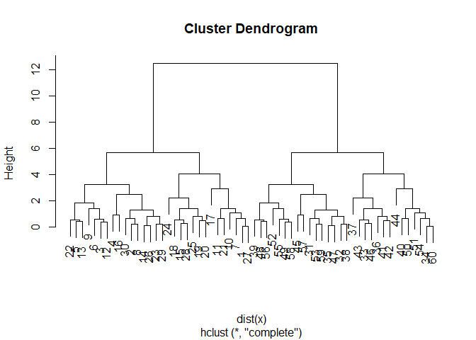<!-- -->


```r
# The hclust() function returns a hierarchical
# clustering model

hc <- hclust(d = dist_matrix)
```

Lets draw the tree


```r
plot(hc)
abline(h=6, col="red")
```

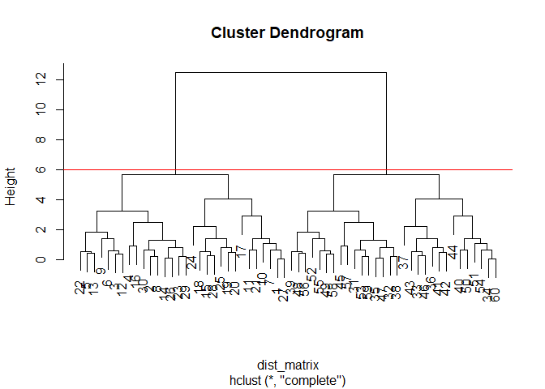<!-- -->

I can 'cut' the tree at any height to give our clusters...


```r
# Cut at height 6
cutree(hc, h=6)
```

```
##  [1] 1 1 1 1 1 1 1 1 1 1 1 1 1 1 1 1 1 1 1 1 1 1 1 1 1 1 1 1 1 1 2 2 2 2 2
## [36] 2 2 2 2 2 2 2 2 2 2 2 2 2 2 2 2 2 2 2 2 2 2 2 2 2
```

cut into k grps


```r
cutree(hc, k=2)
```

```
##  [1] 1 1 1 1 1 1 1 1 1 1 1 1 1 1 1 1 1 1 1 1 1 1 1 1 1 1 1 1 1 1 2 2 2 2 2
## [36] 2 2 2 2 2 2 2 2 2 2 2 2 2 2 2 2 2 2 2 2 2 2 2 2 2
```

apply()

```r
apply(x, 2, sd)
```

```
##        x        y 
## 3.291193 3.291193
```


**YOUR TURN**


```r
x <- rbind(
 matrix(rnorm(100, mean=0, sd = 0.3), ncol = 2), # c1
 matrix(rnorm(100, mean = 1, sd = 0.3), ncol = 2), # c2
 matrix(c(rnorm(50, mean = 1, sd = 0.3), # c3
 rnorm(50, mean = 0, sd = 0.3)), ncol = 2))
colnames(x) <- c("x", "y")
```


```r
plot(x)
```

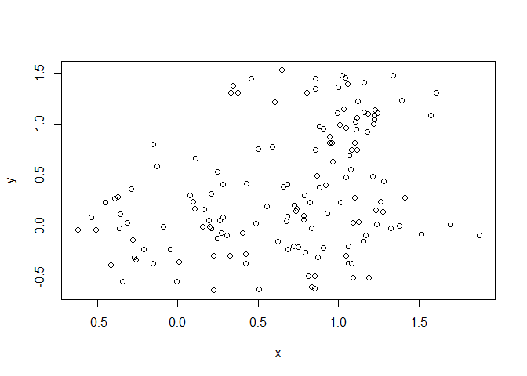<!-- -->


```r
col <- as.factor( rep(c("c1", "c2", "c3"), each=50))
```


```r
plot(x, col=col)
```

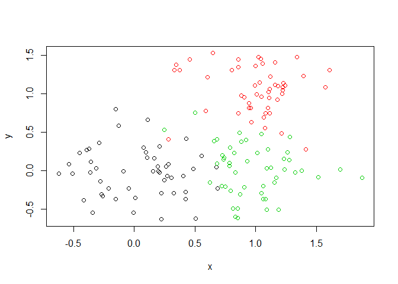<!-- -->

Q. Use the dist(), hclust(), plot() and cutree() functions to return 2 and 3 clusters 


```r
d <- dist(x)
hc <- hclust(d)
plot(hc)
```

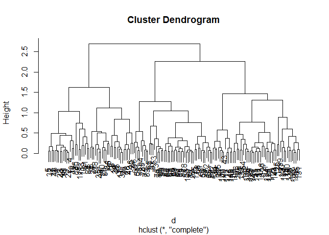<!-- -->


```r
# To return 2 clusters I could cut at h=2.5 or set k=2
members2 <- cutree(hc, k=2)

# To return 3 clusters I could cut at h=2 or set k=3
members3 <- cutree(hc, k=3)

# Let's look at both
members <- cbind(k2=members2, k3=members3)
```

Plot


```r
plot(x, col=members3, pch=15)
```

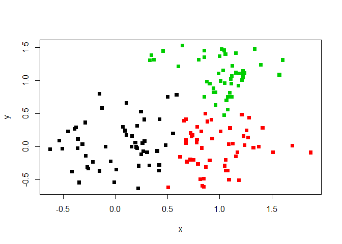<!-- -->


**How to do PCA in R**


```r
# Generating example data to work with
mydata <- matrix(nrow=100, ncol=10)

# Let's label the rows  gene1, gene2 etc. to gene100
rownames(mydata) <- paste("gene", 1:100, sep="")

# Let's label the first 5 columns wt1, wt2, wt3, wt4 and wt5 and the last 5 ko1, ko2 etc. to ko5 (for "knock-out")
colnames(mydata) <- c(paste("wt", 1:5, sep=""),
                      paste("ko", 1:5, sep=""))

# Fill in some fake read counts
for(i in 1:nrow(mydata)) {
  wt.values <- rpois(5, lambda=sample(x=10:1000, size=1))
  ko.values <- rpois(5, lambda=sample(x=10:1000, size=1))
  mydata[i,] <- c(wt.values, ko.values)
}

head(t(mydata))
```

```
##     gene1 gene2 gene3 gene4 gene5 gene6 gene7 gene8 gene9 gene10 gene11
## wt1   524   693   108    23   791   445   884   202   107    133     86
## wt2   544   719   124    22   758   441   924   242   110    121     80
## wt3   562   670   119    18   778   442   936   239   111    133     78
## wt4   522   707   135    16   807   443   882   221   104    109     90
## wt5   506   732    99    15   765   412   855   213   116    117    108
## ko1    92   899   260    78   663   357   704   135   760    809    478
##     gene12 gene13 gene14 gene15 gene16 gene17 gene18 gene19 gene20 gene21
## wt1    204    629    648    205    513    926    855    442    213    168
## wt2    195    640    687    160    507    913    887    430    208    172
## wt3    199    656    716    172    503    910    894    448    225    168
## wt4    177    639    697    159    565    924    974    431    211    167
## wt5    188    600    643    164    528    937    916    481    231    185
## ko1     26    154    226    878    515    101    161   1000    121    279
##     gene22 gene23 gene24 gene25 gene26 gene27 gene28 gene29 gene30 gene31
## wt1    324    728    691    264    631   1029    672     60    685    224
## wt2    291    712    711    271    610    982    604     34    742    205
## wt3    358    695    660    237    591   1000    572     49    718    217
## wt4    309    705    752    237    658   1042    619     68    716    207
## wt5    336    699    729    247    629   1037    579     53    711    205
## ko1    169    247    370    978    949    488    358    122    761    645
##     gene32 gene33 gene34 gene35 gene36 gene37 gene38 gene39 gene40 gene41
## wt1    760    848    289     61    706    292    397     89    272    804
## wt2    775    875    314     76    744    266    417    117    274    819
## wt3    771    882    314     70    762    280    424     97    262    869
## wt4    725    901    304     72    695    260    412    106    257    840
## wt5    801    948    327     63    707    298    389     98    294    835
## ko1    964    407    491    686     47    567    759    696    121    311
##     gene42 gene43 gene44 gene45 gene46 gene47 gene48 gene49 gene50 gene51
## wt1    350    677    331    667    645    826    532    326    764    115
## wt2    371    668    314    682    668    727    509    334    753     87
## wt3    370    636    344    688    711    794    551    335    743     95
## wt4    379    631    327    689    731    793    563    322    725    125
## wt5    382    651    351    704    678    777    476    322    733    111
## ko1    737    437    645    812    372    249    828    668    920    374
##     gene52 gene53 gene54 gene55 gene56 gene57 gene58 gene59 gene60 gene61
## wt1   1009    868    236    547    512    272    578    180    393     69
## wt2    953    900    231    608    529    273    535    195    408     65
## wt3    948    955    245    628    512    264    542    216    418     66
## wt4    943    917    266    566    505    284    554    179    395     63
## wt5    895    811    275    598    465    275    506    192    401     66
## ko1    180    467    587     82     30    151    552    374    521    345
##     gene62 gene63 gene64 gene65 gene66 gene67 gene68 gene69 gene70 gene71
## wt1    490    899    934    634    254    923    715    999    937    800
## wt2    537    968    929    624    241    876    693    987   1000    833
## wt3    514    947    940    625    221    902    703    962    952    806
## wt4    486    913    974    597    218    884    712   1001    978    809
## wt5    503    935    954    524    228    887    712    958    941    771
## ko1    611    649    196   1013    347    272    100    423    379    788
##     gene72 gene73 gene74 gene75 gene76 gene77 gene78 gene79 gene80 gene81
## wt1    595    998    793     27    108    603    403    570    822    219
## wt2    622    932    772     35    116    571    403    571    853    214
## wt3    622    974    772     35    115    610    384    494    863    214
## wt4    588    992    749     38    113    575    397    602    833    229
## wt5    626   1040    775     29    125    617    415    581    858    189
## ko1    163     32    295    261   1006     78    718     68    105    453
##     gene82 gene83 gene84 gene85 gene86 gene87 gene88 gene89 gene90 gene91
## wt1    779    989    625    926    809    931    915    309    229    824
## wt2    803   1007    632    971    854    894    893    349    252    736
## wt3    763    977    636    967    803    916    908    330    241    758
## wt4    782    953    603   1058    799    946    980    316    254    762
## wt5    748    980    623    974    754    912    976    315    236    687
## ko1    255    743    220     90     37    740    117    440    635    562
##     gene92 gene93 gene94 gene95 gene96 gene97 gene98 gene99 gene100
## wt1    514    647     80    366    376    743    140    888     295
## wt2    513    714     72    386    365    792    136    839     351
## wt3    499    698     82    352    362    776    141    851     315
## wt4    474    686     80    376    400    802    129    889     319
## wt5    528    627     71    374    380    742    143    876     316
## ko1    539    749    671     76    787    692    774    582     673
```


```r
# Let's do PCA
pca <- prcomp(t(mydata), scale=TRUE)
pca
```

```
## Standard deviations (1, .., p=10):
##  [1] 9.654554e+00 1.347565e+00 1.248861e+00 1.054583e+00 8.967491e-01
##  [6] 8.756483e-01 6.257714e-01 4.343374e-01 3.881907e-01 3.207753e-15
## 
## Rotation (n x k) = (100 x 10):
##                 PC1           PC2           PC3          PC4          PC5
## gene1   -0.10332597 -0.0047852284  0.0010474587 -0.054193524  0.013793791
## gene2    0.10223235 -0.0555549828 -0.0362582329  0.056731842  0.024550512
## gene3    0.10176216 -0.0075361532  0.0413590533 -0.042677346 -0.048086130
## gene4    0.10160130  0.0480367310 -0.0808443503  0.007973961 -0.031309880
## gene5   -0.09947846  0.0063805003  0.0591380145  0.002109853 -0.260567702
## gene6   -0.10065760  0.1283297268  0.0517708997 -0.078354741 -0.031611810
## gene7   -0.09722439 -0.1034724970  0.0335199238 -0.281208912 -0.045890947
## gene8   -0.09502279 -0.0218349310 -0.0883243289 -0.294610055  0.074651014
## gene9    0.10347934  0.0051139309 -0.0006546056 -0.014062419 -0.018389311
## gene10   0.10329784  0.0333704697  0.0153727939 -0.018967948 -0.003458179
## gene11   0.10322616 -0.0241834379  0.0457320339  0.014483398  0.003169380
## gene12  -0.10317334 -0.0090845144  0.0036007152 -0.041782152  0.004097216
## gene13  -0.10341709  0.0120233167  0.0154988149 -0.026958466  0.017955587
## gene14  -0.10317856 -0.0006583519 -0.0202205869 -0.043494658  0.002665102
## gene15   0.10336557 -0.0034448106  0.0428743555  0.003868202 -0.016103533
## gene16  -0.05896916 -0.0772037936  0.3140405090  0.516963122 -0.051150562
## gene17  -0.10353621 -0.0133061974 -0.0067704913  0.011492890  0.004101202
## gene18  -0.10332559 -0.0022021397 -0.0018548776  0.034648210  0.016715200
## gene19   0.10314236  0.0312121014 -0.0308205632  0.045422914  0.026495189
## gene20  -0.10120824  0.0591536211 -0.0359843959  0.083946804  0.124770271
## gene21   0.09703826  0.1533788328 -0.1298327243  0.144140349  0.143944724
## gene22  -0.10030277 -0.1007121860 -0.0332535657 -0.009259722 -0.079754604
## gene23  -0.10347566  0.0035748588  0.0017066497 -0.013620824 -0.014001966
## gene24  -0.10254873 -0.0239556244 -0.0184406957  0.072720791 -0.002780095
## gene25   0.10303325  0.0628307598 -0.0355358366  0.008735577  0.011564588
## gene26   0.10198870  0.0469921765  0.0459329308  0.107776149  0.014324687
## gene27  -0.10335627 -0.0095697026 -0.0054171894  0.040243692 -0.034787507
## gene28  -0.10117787  0.0434728995  0.0215467764  0.009636992 -0.148004985
## gene29   0.09915073  0.0500868274  0.0943926038  0.163820862 -0.152855267
## gene30   0.06524914 -0.2394090047  0.4160192217 -0.241131785  0.333853054
## gene31   0.10308804  0.0610191086 -0.0113621399  0.020264060  0.002008320
## gene32   0.10136709 -0.0432510628 -0.0167417052  0.033075200  0.162168939
## gene33  -0.10282562 -0.0308837547  0.0104731683  0.046827609  0.073436593
## gene34   0.10089013  0.0109387804 -0.1768814038  0.010942134 -0.015412540
## gene35   0.10321969 -0.0177777208 -0.0003219699 -0.001899178 -0.014748050
## gene36  -0.10338376 -0.0020993978 -0.0169901809 -0.039187023  0.033589145
## gene37   0.10297760  0.0373394945  0.0140371472  0.039560425  0.033554786
## gene38   0.10260882  0.0668561657 -0.0294799855 -0.025887964  0.007855263
## gene39   0.10334002 -0.0017286164 -0.0302231191 -0.012301471 -0.025732451
## gene40  -0.10188562  0.0114959475  0.0151647283  0.040536413  0.122182927
## gene41  -0.10327580 -0.0203334076  0.0100640610 -0.008791195  0.025659657
## gene42   0.10338459 -0.0047878382  0.0206049563  0.005007312  0.020156829
## gene43  -0.10238150 -0.0416001506  0.0555843409 -0.026803375  0.022810789
## gene44   0.10286744 -0.0185245851 -0.0173286984  0.063475063  0.001842188
## gene45   0.10021038  0.0887154182  0.0145311609  0.055399059  0.145999770
## gene46  -0.10249455  0.0133858346 -0.0384678265  0.011652598 -0.012341440
## gene47  -0.10320167 -0.0020181849  0.0333158116  0.032251884 -0.042202139
## gene48   0.10085336 -0.0584557197  0.0735847212 -0.064349663 -0.153172798
## gene49   0.10291751  0.0613201671 -0.0348387826 -0.025635206 -0.004528260
## gene50   0.09945734 -0.0948801614 -0.0827331212 -0.115345956 -0.195284263
## gene51   0.10250178 -0.0349079687  0.0581328952  0.079696070 -0.044878931
## gene52  -0.10335773  0.0106871483  0.0026486533 -0.019989485 -0.034406641
## gene53  -0.10226598  0.0299929741  0.0493005157 -0.078944952  0.017693925
## gene54   0.10205207 -0.0890162436  0.0552604495  0.021330702 -0.030446369
## gene55  -0.10314298 -0.0172762062 -0.0387212261 -0.027103717  0.065224819
## gene56  -0.10337403  0.0029999854  0.0050347499 -0.050795948 -0.004963646
## gene57  -0.10141063  0.0405075010  0.1096906123  0.046809263  0.094060119
## gene58   0.02559366  0.3912049125  0.5957355400 -0.114523400 -0.253718132
## gene59   0.10271141 -0.0473502284 -0.0185343866 -0.078139933 -0.016131578
## gene60   0.09948015 -0.0837887609 -0.1504988629 -0.106181082 -0.131009713
## gene61   0.10349262  0.0126743798 -0.0103307467 -0.003621310 -0.023610330
## gene62   0.09772805 -0.0500395270 -0.1316601319 -0.112665156  0.155141820
## gene63  -0.10256915 -0.0272336246 -0.0559236526 -0.046257343  0.094033686
## gene64  -0.10353537 -0.0108715712 -0.0030589378  0.014873871 -0.001678144
## gene65   0.10223124  0.0267072418  0.0647853131 -0.084454236 -0.046665818
## gene66   0.10111329 -0.0501547170 -0.0246751691 -0.089694976 -0.142037349
## gene67  -0.10347601 -0.0094320732 -0.0053631366 -0.005769410 -0.027669394
## gene68  -0.10351506 -0.0006478827 -0.0139439187  0.003349676 -0.014134455
## gene69  -0.10337700  0.0061854521 -0.0066063381 -0.019681270 -0.041885673
## gene70  -0.10336030 -0.0115658731 -0.0082110119 -0.022411101  0.023964938
## gene71  -0.04744330  0.5452568226  0.1126925462 -0.196781611  0.436370405
## gene72  -0.10330819 -0.0098937045 -0.0408127807 -0.003391674  0.048400775
## gene73  -0.10340925 -0.0178245342 -0.0106900198  0.039807577 -0.004200599
## gene74  -0.10335207 -0.0248468722 -0.0088062483 -0.005794663 -0.003398319
## gene75   0.10347192 -0.0070511729  0.0201278700 -0.011056350 -0.009074875
## gene76   0.10351810  0.0071606432  0.0086032722  0.013732736  0.009179275
## gene77  -0.10338884 -0.0176787262 -0.0058226009  0.011879932  0.009696637
## gene78   0.10282344  0.0346033391  0.0236122802  0.059478521  0.059379616
## gene79  -0.10300830 -0.0140677745  0.0125116223  0.049766291 -0.003412762
## gene80  -0.10346253 -0.0245981451 -0.0164669761 -0.012150502  0.021636787
## gene81   0.10260121  0.0650428992  0.0467361909 -0.039672209 -0.032551040
## gene82  -0.10336263  0.0218524888  0.0076655158 -0.007256391  0.035919500
## gene83  -0.10173150 -0.0497078191 -0.0082128308 -0.006334081  0.069903000
## gene84  -0.10341399 -0.0041685967 -0.0052153280 -0.026761959  0.030718400
## gene85  -0.10335151 -0.0145865491 -0.0064639759  0.015371254 -0.003182882
## gene86  -0.10338456  0.0001204142 -0.0006823844 -0.045937877  0.008287080
## gene87  -0.10217587  0.0042680591 -0.0110189928  0.055684447 -0.131153726
## gene88  -0.10335689 -0.0201319474 -0.0044522804  0.045694818 -0.004304620
## gene89   0.10010750 -0.0928675140  0.0576737710 -0.170437649  0.033692367
## gene90   0.10292252 -0.0037161562  0.0635731618 -0.010075032  0.024946359
## gene91  -0.08981588  0.1457323878  0.0820126102 -0.208575996 -0.389371278
## gene92   0.04421164 -0.5138748363  0.3754345802 -0.079313591  0.151574136
## gene93   0.09039073  0.0243290786 -0.0817440681 -0.362072531 -0.093576897
## gene94   0.10348457  0.0195409132  0.0073171805  0.000391905 -0.009862714
## gene95  -0.10335798 -0.0070617021 -0.0152745137  0.012882255  0.030320583
## gene96   0.10317270  0.0109020289  0.0275909538  0.052333411 -0.001917235
## gene97  -0.08650419 -0.1636565324 -0.0150826799 -0.138652451 -0.086673412
## gene98   0.10336084  0.0119538033  0.0141407615 -0.016108264 -0.007227945
## gene99  -0.10292730 -0.0138264849  0.0542858548  0.064929189 -0.041225511
## gene100  0.10319098  0.0097670871 -0.0133349409 -0.040560143  0.026825279
##                   PC6          PC7           PC8          PC9
## gene1   -1.371838e-04 -0.020002203  0.0362923119 -0.081210055
## gene2   -3.904585e-02  0.038866828  0.0335320066  0.283644498
## gene3   -1.509954e-01 -0.047048760  0.2127097138 -0.089820845
## gene4    9.624683e-04  0.208447478  0.1642648061 -0.055041517
## gene5   -8.554317e-02 -0.172679550 -0.0166778820  0.028315548
## gene6   -3.614903e-02 -0.014745472  0.2319002071 -0.132528665
## gene7   -5.637951e-02  0.041493737 -0.1092239648 -0.134445724
## gene8   -1.470872e-01 -0.154108751 -0.3004843842  0.096636413
## gene9   -1.419933e-03 -0.057237173 -0.0007686146  0.023147786
## gene10   1.913257e-02 -0.076413026 -0.0116177538  0.008232580
## gene11   6.142637e-03 -0.021527357 -0.0942165955  0.047012493
## gene12   7.921616e-02  0.029349071  0.0397520506 -0.038845650
## gene13  -1.206699e-02  0.002910799  0.0364727753 -0.082881289
## gene14  -6.229834e-02  0.013941239 -0.0274832983 -0.107960919
## gene15   2.170125e-02  0.019963489  0.0267058456 -0.047031961
## gene16  -5.246514e-01  0.022771588  0.0036996844  0.065450495
## gene17   1.281120e-02 -0.004283034  0.0174201554  0.020626498
## gene18  -5.865319e-02 -0.037899780 -0.0218600907  0.005550349
## gene19   2.330427e-02  0.024017627 -0.0915444564 -0.020318520
## gene20   9.011388e-02 -0.049942553 -0.1854558852 -0.136653456
## gene21   4.107394e-02 -0.065570538  0.2271831553 -0.072795138
## gene22   9.471211e-02 -0.055756388 -0.2104541360 -0.368277801
## gene23   2.739928e-02  0.004089001  0.0114012830  0.080550977
## gene24  -7.772768e-02 -0.028605902  0.1398660889  0.156126154
## gene25   8.862239e-03  0.033700279 -0.0345327073  0.053511152
## gene26  -4.137373e-02  0.118467932 -0.1164282897  0.068349381
## gene27   9.395195e-03 -0.025347014 -0.0527118967  0.054524752
## gene28   5.980454e-02  0.174864476  0.0452922276  0.242073515
## gene29  -3.962316e-02 -0.158984189  0.1010206194 -0.153399332
## gene30  -1.748230e-01 -0.348268219  0.1427787975  0.022213332
## gene31   1.377416e-02 -0.019513276  0.0721226667 -0.070124434
## gene32   1.332192e-01  0.007857846  0.0716394590 -0.097642370
## gene33   2.015202e-03 -0.104471369 -0.0823473317  0.040015675
## gene34  -4.551422e-02 -0.014122183 -0.0202035948  0.031148679
## gene35  -2.891428e-02  0.098530363 -0.0952069401 -0.003799364
## gene36   1.368777e-02 -0.006659355  0.0092385415 -0.057472220
## gene37   8.066699e-02 -0.045476076 -0.0163220501 -0.038727863
## gene38  -2.728403e-02  0.039369913 -0.1945589563  0.016634689
## gene39  -3.400645e-02  0.042792296 -0.0538563753  0.045302188
## gene40   1.135510e-01 -0.118447503  0.0157091268  0.130196733
## gene41  -1.178397e-02 -0.072159674  0.0122337170 -0.118889871
## gene42  -2.935806e-02 -0.038788667 -0.0850983425  0.019547232
## gene43   9.183861e-02  0.087593751  0.1091696429  0.117268334
## gene44   7.947317e-03  0.017946366  0.0969794043 -0.202024942
## gene45   4.685381e-03 -0.196907209 -0.2645339414  0.051045194
## gene46  -1.190207e-01 -0.073288481 -0.1302010885 -0.107521884
## gene47   4.479875e-02 -0.005267692  0.0047821829 -0.095452184
## gene48  -1.065819e-01  0.008283078  0.0444725895 -0.176356523
## gene49   4.454945e-03 -0.037141417 -0.1073624423  0.058485128
## gene50   1.454065e-02  0.066708182  0.0706918596  0.132614888
## gene51  -3.385870e-02  0.058896204  0.0752839996 -0.089255357
## gene52   2.483159e-02  0.048496066  0.0808076837 -0.007893934
## gene53  -7.221865e-02  0.018075910 -0.0378765938 -0.232838487
## gene54  -3.276483e-02  0.032792164 -0.1994862738  0.024915771
## gene55  -3.130699e-03 -0.002318982 -0.0243823500 -0.087088813
## gene56  -1.067238e-02  0.039326074  0.0389322088  0.008790036
## gene57  -1.048223e-03 -0.021435186 -0.1905641140  0.143074574
## gene58   1.692920e-01  0.192127699 -0.1296618555 -0.101592561
## gene59  -4.953471e-03 -0.019754666 -0.1372459168 -0.094016978
## gene60  -6.036970e-02  0.007589629  0.0092539210 -0.045553062
## gene61  -6.396225e-05 -0.030724444  0.0433086411 -0.005496930
## gene62  -5.361604e-02  0.326404457  0.0419481628 -0.055107101
## gene63  -2.580438e-02  0.007585756  0.1204509818 -0.051595249
## gene64  -1.260675e-02 -0.013930654 -0.0243346716  0.015677029
## gene65  -1.797502e-02  0.105823215  0.0864310544 -0.122725943
## gene66   7.293248e-02  0.060403943  0.0472788734  0.262816097
## gene67   3.501290e-02  0.002614351  0.0240942908 -0.019663766
## gene68   1.617450e-02 -0.022624085 -0.0248113322  0.038356194
## gene69  -8.944732e-03 -0.016263733  0.0361088226  0.099385189
## gene70  -4.352132e-02  0.014881639  0.0753460747  0.038360511
## gene71  -1.599037e-01  0.179591211  0.0732857411  0.083957868
## gene72   2.154970e-02  0.010825008  0.0139231144 -0.024873567
## gene73   2.743199e-02 -0.018600785 -0.0078632890 -0.002498918
## gene74   4.657865e-02  0.059762101  0.0055302302  0.003852928
## gene75  -3.644517e-02 -0.005371191 -0.0116306720 -0.021352741
## gene76  -8.893015e-03 -0.008635232  0.0426277374 -0.039804609
## gene77   5.259833e-02 -0.021906871 -0.0274620394 -0.047896804
## gene78   1.756874e-02 -0.031130143  0.1469747306 -0.009238334
## gene79  -2.540901e-02  0.012399892  0.0507261980  0.208697801
## gene80   4.323096e-03 -0.014905839  0.0081548588 -0.018817944
## gene81  -2.693548e-02 -0.060005754 -0.1125108724  0.069466858
## gene82  -9.391293e-03  0.066383083  0.0253659296  0.035110796
## gene83   4.199391e-02  0.253280739  0.0351932734 -0.020692370
## gene84   3.850871e-02 -0.021617423  0.0282711919 -0.020814093
## gene85  -6.637755e-02 -0.011891703 -0.0267778288  0.022791623
## gene86  -9.011398e-03  0.032547897  0.0583620915  0.037352967
## gene87  -4.520648e-02 -0.072644025  0.1611898188 -0.075244847
## gene88  -1.524155e-02 -0.047604119  0.0125876557  0.021035327
## gene89  -6.426807e-02 -0.111144696  0.1333255491  0.055505854
## gene90  -3.756927e-02 -0.081186487  0.0984521373 -0.034950621
## gene91   1.167657e-01 -0.177426361  0.0795439358  0.177510903
## gene92   3.143395e-01  0.205185933  0.0302021422  0.060343684
## gene93  -2.866196e-01 -0.145955252  0.1129982920  0.048075697
## gene94  -6.259911e-03  0.012801397 -0.0670911596 -0.006141743
## gene95  -1.647069e-02  0.036265958  0.0588627881  0.099439426
## gene96  -3.513991e-02  0.064415663 -0.0644748069 -0.005143986
## gene97  -4.544182e-01  0.405339816 -0.1282168605 -0.046308878
## gene98   1.111149e-02 -0.022977751 -0.1178347518  0.049358061
## gene99   2.265936e-02  0.003335754 -0.0657175822  0.045690115
## gene100 -4.268883e-02  0.001965862 -0.0869634492  0.108556977
##                  PC10
## gene1    0.1168252050
## gene2    0.2091098948
## gene3   -0.0293939388
## gene4   -0.0400039621
## gene5   -0.2481183405
## gene6   -0.0466691543
## gene7   -0.1422299232
## gene8   -0.0342865444
## gene9   -0.0513727844
## gene10  -0.0190244783
## gene11   0.0021799970
## gene12   0.0229475888
## gene13   0.0145521522
## gene14  -0.0246279466
## gene15  -0.0106129240
## gene16   0.0086260510
## gene17   0.0321762269
## gene18  -0.0287750549
## gene19  -0.0384778745
## gene20   0.0862402450
## gene21   0.0233747792
## gene22  -0.0073098416
## gene23   0.0122692476
## gene24   0.0730834522
## gene25   0.0408894494
## gene26  -0.0378949376
## gene27  -0.0281832149
## gene28  -0.0355555487
## gene29  -0.0760119418
## gene30   0.2714440629
## gene31  -0.0621985048
## gene32   0.0076611613
## gene33  -0.0152840545
## gene34   0.1025345184
## gene35   0.0057990325
## gene36  -0.0169610414
## gene37  -0.0666342687
## gene38   0.0339035151
## gene39   0.0115821759
## gene40   0.0760065274
## gene41  -0.0038507784
## gene42  -0.0836193249
## gene43   0.0690854957
## gene44  -0.0038491804
## gene45  -0.1746151371
## gene46   0.1138728474
## gene47  -0.0298875534
## gene48  -0.0540035530
## gene49   0.0546742497
## gene50   0.0759909839
## gene51  -0.0878581789
## gene52   0.0049453588
## gene53  -0.0076239708
## gene54  -0.0207217919
## gene55   0.0384565321
## gene56   0.0202744799
## gene57  -0.0124505684
## gene58   0.3879929880
## gene59   0.0612366838
## gene60   0.0646320195
## gene61  -0.0209719809
## gene62   0.2014230278
## gene63   0.0667696646
## gene64   0.0359174051
## gene65  -0.0036630336
## gene66   0.0266220548
## gene67   0.0104025444
## gene68   0.0161930347
## gene69  -0.0150273451
## gene70   0.0315686972
## gene71  -0.3744556189
## gene72   0.0247755498
## gene73   0.0369517000
## gene74   0.0288244369
## gene75  -0.0242085196
## gene76   0.0001206286
## gene77   0.0504357309
## gene78  -0.0128556757
## gene79   0.0342150614
## gene80   0.0078275206
## gene81  -0.0014681564
## gene82   0.0031081429
## gene83   0.1399679944
## gene84   0.0529760626
## gene85   0.0251201711
## gene86  -0.0080893080
## gene87  -0.0653873562
## gene88  -0.0191821542
## gene89  -0.0741370216
## gene90  -0.0964795357
## gene91  -0.2497583214
## gene92  -0.3440305036
## gene93   0.1718853412
## gene94  -0.0148521504
## gene95   0.0328616273
## gene96  -0.0914220331
## gene97  -0.1335787364
## gene98   0.0323508461
## gene99   0.0679419585
## gene100  0.0573323348
```

```r
# See what is returned by the prcomp() function
attributes(pca)
```

```
## $names
## [1] "sdev"     "rotation" "center"   "scale"    "x"       
## 
## $class
## [1] "prcomp"
```

```r
# A basic PC1 vs PC2 2-D plot
plot(pca$x[,1], pca$x[,2])
```

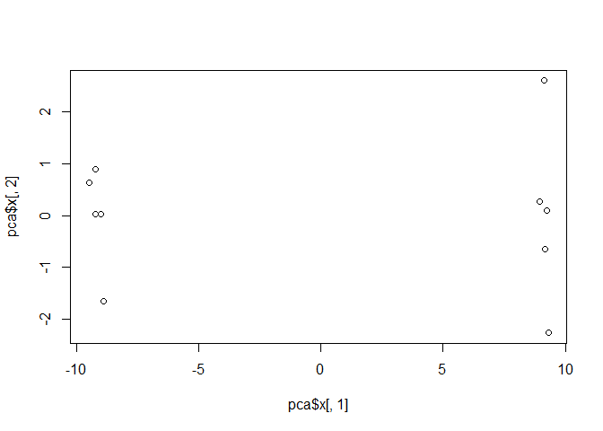<!-- -->

```r
# Variance capture per PC
# How well are our PC's capturing our data spread (i.e. variance)
pca.var <- pca$sdev^2
pca.var.per <- round(pca.var/sum(pca.var)*100, 1)

# Plot our screen plot
barplot(pca.var.per, main="Screen Plot", xlab="Principal Component", ylab="Percent Variation")
```

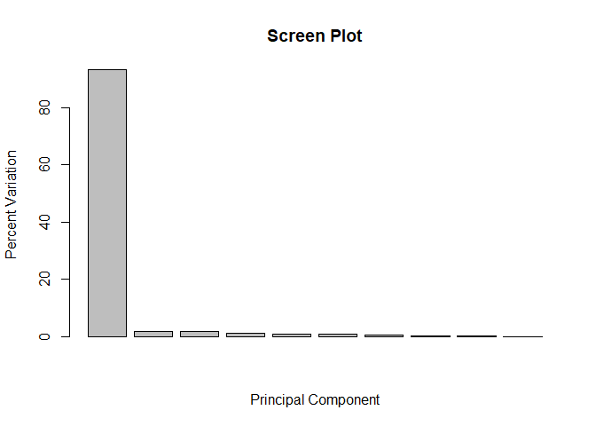<!-- -->

Color Vector

```r
# A vector of colors for wt and ko samples
colvec <- colnames(mydata)
colvec[grep("wt", colvec)] <- "red"
colvec[grep("ko", colvec)] <- "blue"

# Plot
plot(pca$x[,1], pca$x[,2], col=colvec, pch=16,
     xlab=paste0("PC1(", pca.var.per[1], "%)"),
     ylab=paste0("PC2(", pca.var.per[2], "%)"))

# Click to identify which sample is which
identify(pca$x[,1], pca$x[,2],  labels=colnames(mydata))
```

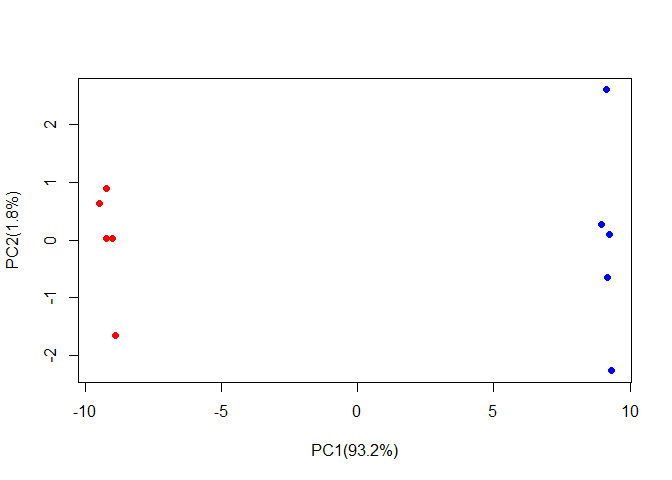<!-- -->

```
## integer(0)
```

```r
##한번에 console에서 run하기
```


**UK FOODS**

```r
#reading UK FOODS
UK_foods <- read.csv("UK_foods.csv", row.names = 1)
View(UK_foods)
```


